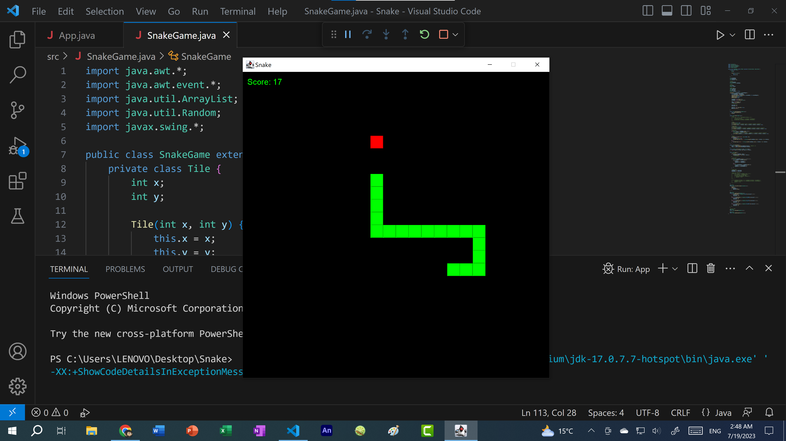

# Snake-Game

A classic Snake game built using Java Swing. Players control a snake that grows longer with each piece of food it consumes, navigating the game board while avoiding collisions with the walls or its own body.

